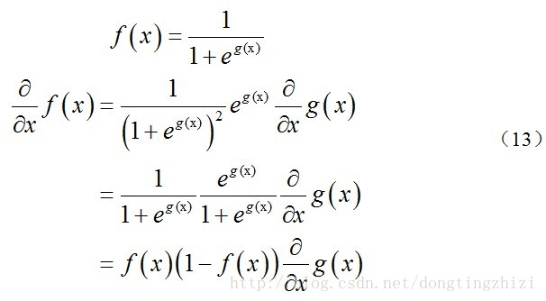
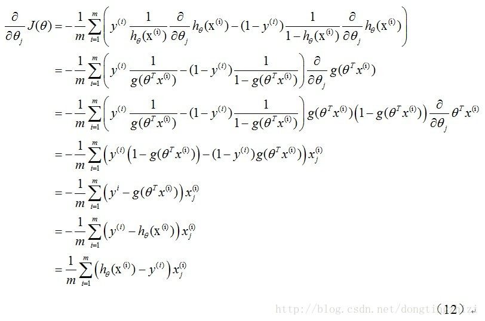

## 逻辑回归公式

###作者：wangzhong

logistic regression是一种分类方法，用于二分类，需要找到一个预测函数，且输出只有两个值，代表两个类别，所以这里利用了logistic函数，或者叫sigmoid函数。

### 预测函数

$$
h_\theta(x)=g(\theta^Tx)=\frac{1}{1+e^{-\theta^Tx}}
$$

---

预测函数的值代表着结果为1的概率（因为是二分类，结果只有0和1）

因为0和1的概率分别为：
$$
P(y=1|x;\theta) = h_\theta(x)\\
P(y=0|x;\theta) = 1-h_\theta(x)
$$
上式可以综合起来写成：
$$
P(y|x;\theta) = {h_\theta(x)}^y{(1-h_\theta(x))}^{1-y}
$$
这个式子可以理解成某个样本基于其类别或者说label的观测概率。

对于训练集，因为label是已知的（可以理解成掷硬币，每次的结果都已知），整体的概率为每个样本的概率相乘

即似然函数公式：
$$
\begin{aligned}
L(\theta) &=\prod^m_{i=1}P(y^i|x^i;\theta)\\
&=\prod^m_{i=1}{h_\theta(x^i)}^{y^i}{(1-h_\theta(x^i))}^{{(1-y)}^i}
\end{aligned}
$$

### 损失函数

将上面的似然函数取对数可得：
$$
l(\theta)=log(L(\theta))=\sum^m_{i=1}(y^ilog(h_\theta(x^i))+(1-y^i)log(1-h_\theta(x^i)))
$$
其实我们的本质目标是求得最大似然估计，即求得θ使得上面的似然函数为最大。在前面乘上一个负的系数之和，就成了我们的损失函数，求最小值。

损失函数：
$$
\begin{aligned}
J(\theta) &= -\frac{1}{m}l(\theta)\\
&=-\frac{1}{m}\sum^m_{i=1}(y^ilog(h_\theta(x^i))+(1-y^i)log(1-h_\theta(x^i)))
\end{aligned}
$$

---

### 梯度下降

求解θ，原理同线性回归

逻辑回归对损失函数求偏导需要用到下面的公式：

梯度下降推导过程：

梯度更新的最终公式为：
$$
\theta_j=\theta_j-\frac{\alpha}{m}\sum^m_{i=1}(h_\theta(x^i)-y^i)x_j^{(i)}
$$

---

可以看到形式是同线性回归一样的，只是h(x)不一样。