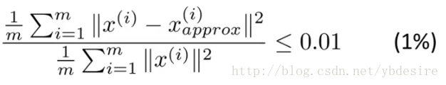

## PCA算法原理

### 作者：wangzhong

PCA主要用于高维建模，解决高维灾难。通过减少数据的特征值，来达到提高训练效率的目的

### 协方差矩阵

$$
cov(X,Y) = E((X - E(X)(Y-E(Y))
$$

此处的E（X）为样本中每个维度的均值

假设X为（m,n）的矩阵，m为样本数，n为维度，则协方差矩阵求解为（先做去均值化）
$$
C = \frac{1}{m}X^TX
$$
对角线上分别是x和y的方差，非对角线上是协方差。协方差大于0表示x和y若有一个增，另一个也增；小于0表示一个增，一个减；协方差为0时，两者独立。协方差绝对值越大，两者对彼此的影响越大，反之越小。

协防差矩阵一定是一个对角矩阵

### 特征值和特征向量

设A为n阶矩阵，如果数λ和n维列向量使关系式
$$
(A-\lambda E)x = 0
$$
则称λ为特征值，x为特征向量

有非零解的充要条件为上面的行列式 = 0，即
$$
|A-\lambda E| = 0
$$
行列式求解法则这里不详细说明，比如简单的2*2矩阵，为对角线相乘再相减

### 特征向量矩阵

特征向量矩阵U为n*n，按照特征值大小排列，若要降维到k维(k<n)，则取前k列

X_reduction = X*U[:,:k]

还原X则为：X_restore =  X_reduction*U[:,:k].T

### 如何评判k的选取

上式等效于用奇异值分解返回的S矩阵的计算，计算如下:
$$
1-\frac{\sum^k_1S_i}{\sum^n_1S_i} <0.01
$$

### 相关定理

若多个特征值不相等，则特征相关线性无关。

### 其他

代码中一般用奇异值分解去求得特征向量矩阵和奇异值矩阵

